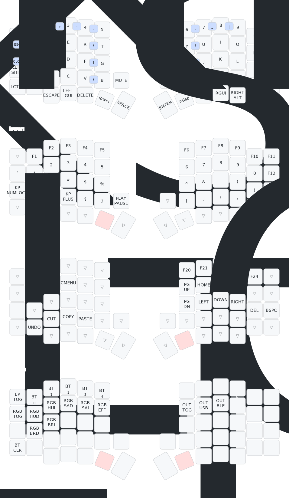

# Sofle V1

## Note

There are other configurations in the project (located in other git branches):
- Added dongle (NiceNano v2 or ProMicro) with NiceView display - the branch `update/add_dongle_niceview`
- Added dongle (NiceNano v2 or ProMicro) with NiceView display and Azoteq touchpad (TPS43) - branch `update/added_dongle_with_azoteq_niceview`
- Added a Azoteq touchpad (TPS43) to the right keyboard (without the E11 encoder on the right keyboard) - branch `in development` 

--- 

> Important note!
>
> The Sofle v1 PCB is configured for OLED displays and to connect the NiceView display, you need to solder the `CS` pin on yours NiceViews to pin P0.06(D1) NiceNano
>
> - NiceNano pinout (https://nicekeyboards.com/docs/nice-nano/pinout-schematic)
> - NiceView pinout (https://nicekeyboards.com/docs/nice-view/pinout-schematic)

---

## Keyboard Cases

I have designed several variants of cases for the Sofle v1 keyboard (an example is in the photo) and if you want to purchase a models in STL format from me for printing on a 3d printer, write to me on Telegram @StelmakhDigital (https://t.me/StelmakhDigital )

## Keyboard pics

Other pics (Click Me)

- PCB Sofle v1 keyboard

- Sofle keyboard without NiceView displays

- Dongle with Azoteq touchpad and NiceView display

## Default keymap
The default keymap of this keyboard can be found here:

## Firmware

### Running the Workflow
The repository has a GitHub workflow that leverages the zmkfirmware/zmk repository to build the firmware. The workflow will build the firmware and upload it as an artifact to the repository.
The workflow is triggered on push, pull_request, and manually via workflow_dispatch. You can trigger the workflow manually by going to the Actions tab in your forked repository and selecting the workflow.

### Workflow Artifact
Once the workflow has completed, you can download the artifact from the Actions tab. The artifact will be a .zip file that contains the firmware. Extract the .zip file in your
local directory.

### Flashing the firmware
1. Connect the keyboard to your computer via USB-C cable.
2. Press the "BOOT" button twice in quick succession to enter bootloader mode.
3. The keyboard should appear as a USB drive on your computer.
4. Drag and drop the `uf2` file that coincides with the side of the keyboard you are flashing onto the USB drive that represents the keyboard.
5. The keyboard will automatically reboot and the new firmware will be flashed.

**Note:** Some operating systems may show a failure when the keyboard reboots, or the USB drive may disappear. This is normal and the keyboard should be flashed successfully.
The keyboard flashing has been confirmed to work successfully on Windows 10, and Linux. 

## Modifying the keymap

### ZMK Keymap
We recommend at least reviewing the [ZMK Keymap documentation](https://zmk.dev/docs/features/keymaps) to understand the structure of the keymap files. This
will help you understand the changes we are making to the generated files. While not required, most example keymaps attempt to show the layout of the keyboard
shown as a comment underneath the layer declaration.

### ZMK Firmware
ZMK does provide an online [keymap editor](https://nickcoutsos.github.io/keymap-editor) and you can use this to change the keymap, this repo is already setup for the use of this editor.
